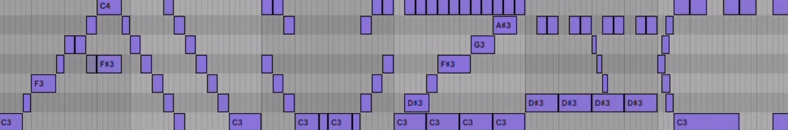
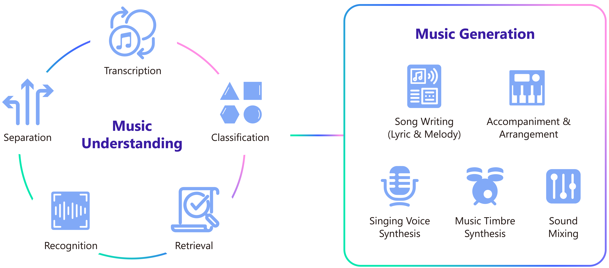

<br/>
<a href="https://github.com/microsoft/muzic"> </a>
<br/>
<br/>

**Muzic** is a research project on AI music that empowers music understanding and generation with deep learning and artificial intelligence. 
Muzic is pronounced as [ˈmjuːzeik] and '谬贼客' (in Chinese). Besides the logo in image version (see above), Muzic also has a logo in video version (you can click here to watch <a href="https://ai-muzic.github.io/muzic_logo/"></a>). Muzic was started by [some researchers](https://www.microsoft.com/en-us/research/project/ai-music/) from [Microsoft Research Asia](https://www.microsoft.com/en-us/research/lab/microsoft-research-asia/).  


<!-- [](https://ai-muzic.github.io/muzic_logo/ "Muzic Video Logo") -->
  

 

<br/>
We summarize the scope of our Muzic project in the following figure:
<br/><br/>
<p align="center">
<a href="https://github.com/microsoft/muzic">
  
</a>
</p>
<br/>


The current work in [Muzic](https://www.microsoft.com/en-us/research/project/ai-music/) include:
* Music Understanding
  + Symbolic Music Understanding: [MusicBERT](https://arxiv.org/pdf/2106.05630.pdf)
  + Automatic Lyrics Transcription: [PDAugment](https://arxiv.org/pdf/2109.07940.pdf) 
* Music Generation
  + Song Writing: [SongMASS](https://arxiv.org/pdf/2012.05168.pdf)
  + Lyric Generation: [DeepRapper](https://arxiv.org/pdf/2107.01875.pdf)
  + Melody Generation: [TeleMelody](https://arxiv.org/pdf/2109.09617.pdf)
  + Accompaniment Generation: [PopMAG](https://arxiv.org/pdf/2008.07703.pdf)
  + Singing Voice Synthesis: [HiFiSinger](https://arxiv.org/pdf/2009.01776.pdf)


## Requirements

The operating system is Linux. We test on Ubuntu 16.04.6 LTS, CUDA 10, with Python 3.6.12. The requirements for running Muzic are listed in `requirements.txt`. To install the requirements, run:
```bash
pip install -r requirements.txt
```
We initially release the code of 5 research work: [MusicBERT](musicbert), [PDAugment](pdaugment), [DeepRapper](deeprapper), [SongMASS](songmass), and [TeleMelody](telemelody). You can find the README in the corresponding folder for detailed instructions on how to use. 


## Reference

If you find the Muzic project useful in your work, you can cite the following papers if there's a need:

* MusicBERT: Symbolic Music Understanding with Large-Scale Pre-Training, Mingliang Zeng, Xu Tan, Rui Wang, Zeqian Ju, Tao Qin, Tie-Yan Liu, ACL 2021.  
* PDAugment: Data Augmentation by Pitch and Duration Adjustments for Automatic Lyrics Transcription, Chen Zhang, Jiaxing Yu, Luchin Chang, Xu Tan, Jiawei Chen, Tao Qin, Kejun Zhang, arXiv 2021.
* DeepRapper: Neural Rap Generation with Rhyme and Rhythm Modeling, Lanqing Xue, Kaitao Song, Duocai Wu, Xu Tan, Nevin L. Zhang, Tao Qin, Wei-Qiang Zhang, Tie-Yan Liu, ACL 2021. 
* SongMASS: Automatic Song Writing with Pre-training and Alignment Constraint, Zhonghao Sheng, Kaitao Song, Xu Tan, Yi Ren, Wei Ye, Shikun Zhang, Tao Qin, AAAI 2021.
* TeleMelody: Lyric-to-Melody Generation with a Template-Based Two-Stage Method, Zeqian Ju, Peiling Lu, Xu Tan, Rui Wang, Chen Zhang, Songruoyao Wu, Kejun Zhang, Xiangyang Li, Tao Qin, Tie-Yan Liu, arXiv 2021.


## Contributing

This project welcomes contributions and suggestions.  Most contributions require you to agree to a
Contributor License Agreement (CLA) declaring that you have the right to, and actually do, grant us
the rights to use your contribution. For details, visit https://cla.opensource.microsoft.com.

When you submit a pull request, a CLA bot will automatically determine whether you need to provide
a CLA and decorate the PR appropriately (e.g., status check, comment). Simply follow the instructions
provided by the bot. You will only need to do this once across all repos using our CLA.

This project has adopted the [Microsoft Open Source Code of Conduct](https://opensource.microsoft.com/codeofconduct/).
For more information see the [Code of Conduct FAQ](https://opensource.microsoft.com/codeofconduct/faq/) or
contact [opencode@microsoft.com](mailto:opencode@microsoft.com) with any additional questions or comments.

## Trademarks

This project may contain trademarks or logos for projects, products, or services. Authorized use of Microsoft 
trademarks or logos is subject to and must follow 
[Microsoft's Trademark & Brand Guidelines](https://www.microsoft.com/en-us/legal/intellectualproperty/trademarks/usage/general).
Use of Microsoft trademarks or logos in modified versions of this project must not cause confusion or imply Microsoft sponsorship.
Any use of third-party trademarks or logos are subject to those third-party's policies.
