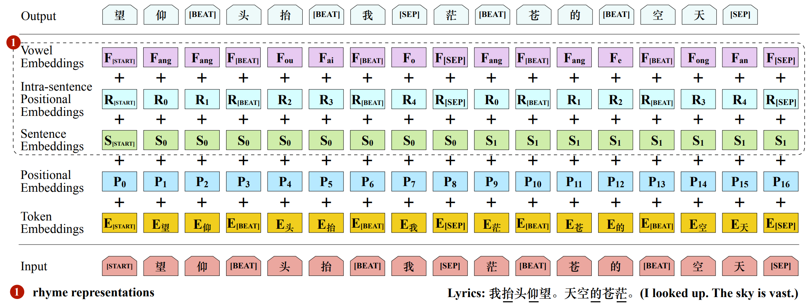

# DeepRapper
[DeepRapper: Neural Rap Generation with Rhyme and Rhythm Modeling](https://arxiv.org/pdf/2107.01875.pdf), by Lanqing Xue, Kaitao Song, Duocai Wu, Xu Tan, Nevin L. Zhang, Tao Qin, Wei-Qiang Zhang, Tie-Yan Liu, ACL 2021, is a Transformer-based rap generation system that can model both rhymes and rhythms. It generates lyrics in the reverse order with rhyme representation and constraint for rhyme enhancement and inserts a beat symbol into lyrics for rhythm/beat modeling. To our knowledge, DeepRapper is the first system to generate rap with both rhymes and rhythms. 

<p align="center"><br/> The input and output representation of DeepRapper model </p>

## 1. Data Preparation
Prepare both lyrics and pinyin for each song. We provide some data samples in `DeepRapper/data/`.

```bash
├── data
│   └── lyrics
│       └── lyrics_samples
│           └── raw
│               └── singer01
│                   └── album01
│                       ├── song01
│                       │   ├── lyric_with_beat_global.txt
│                       │   └── mapped_final_with_beat_global.txt
│                       └── song02
│                           ├── lyric_with_beat_global.txt
│                           └── mapped_final_with_beat_global.txt
```

Here is a sample of `lyric_with_beat_global.txt`:
```
20_[01:12.56][BEAT]那就[BEAT]让我再沉[BEAT]沦这一世
21_[01:14.49][BEAT]不理[BEAT]解早已[BEAT]经不止一次
22_[01:16.59][BEAT]那就[BEAT]让我孤[BEAT]注最后一掷
23_[01:18.61][BEAT]不想昏[BEAT]暗之中[BEAT]度过每日
24_[01:20.60][BEAT]那就[BEAT]让我再[BEAT]沉沦这一世
25_[01:22.48][BEAT]不理[BEAT]解早已[BEAT]经不止一次
26_[01:24.58][BEAT]那就[BEAT]让我孤[BEAT]注最后一掷
27_[01:26.47][BEAT]不想昏[BEAT]暗之[BEAT]中度过每日
```
Here is a sample of `mapped_final_with_beat_global.txt`:
```
20_[01:12.56][BEAT] a ou [BEAT] ang o ai en [BEAT] en e i i
21_[01:14.49][BEAT] u i [BEAT] ie ao i [BEAT] in u i i i
22_[01:16.59][BEAT] a ou [BEAT] ang o u [BEAT] u ei ou i i
23_[01:18.61][BEAT] u ang en [BEAT] an i ong [BEAT] u o ei i
24_[01:20.60][BEAT] a ou [BEAT] ang o ai [BEAT] en en e i i
25_[01:22.48][BEAT] u i [BEAT] ie ao i [BEAT] in u i i i
26_[01:24.58][BEAT] a ou [BEAT] ang o u [BEAT] u ei ou i i
27_[01:26.47][BEAT] u ang en [BEAT] an i [BEAT] ong u o ei i
```

## 2. Training & Generation
We provide a example script for train and generation.
To train, run:

```bash
bash train.sh
```
When training, you may see the logs:

```bash
starting training
epoch 1
time: 2021-xx-xx 11:17:57.067011
51200
now time: 11:17. Step 10 of piece 0 of epoch 1, loss 9.587631130218506
now time: 11:18. Step 20 of piece 0 of epoch 1, loss 9.187388515472412
```
You can specify the arguments in the bash file, such as number of epoch, bach size, etc. The trained model is saved in `[model_dir]/lyrics/[raw_data_dir][_reverse]/[model_sign]/final_model`. For example, in the default `train.sh`, the path is `model/lyrics/lyrics_samples_reverse/samples/final_model`.

To generate by the trained DeepRapper, run
```bash
bash generate.sh
```
You can specify the arguments in the bash file, such as beam width, number of samples, etc.

For more generated samples, visit https://ai-muzic.github.io/deeprapper/.


## 3. Pretrained Model

You can download a pretrained DeepRapper [here](https://msramldl.blob.core.windows.net/modelrelease/deeprapper-model.zip).

To generate by our provided pretrained DeepRapper, first unzip the pretrained DeepRapper. Then, put the unzipped directory `deeprapper-model` under the folder `model/`. So, the complete paths are like the follows:

```bash
├── model
│   └── deeprapper-model
│       ├── pytorch_model.bin
│       └── config.json
```

Finally, run the following command to generate:
```bash
bash generate_from_pretrain.sh
```
