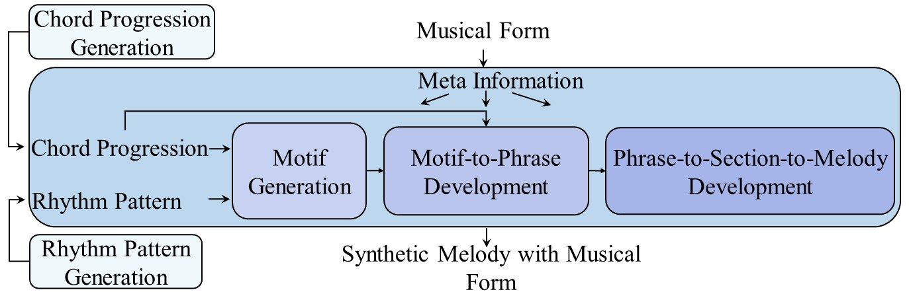
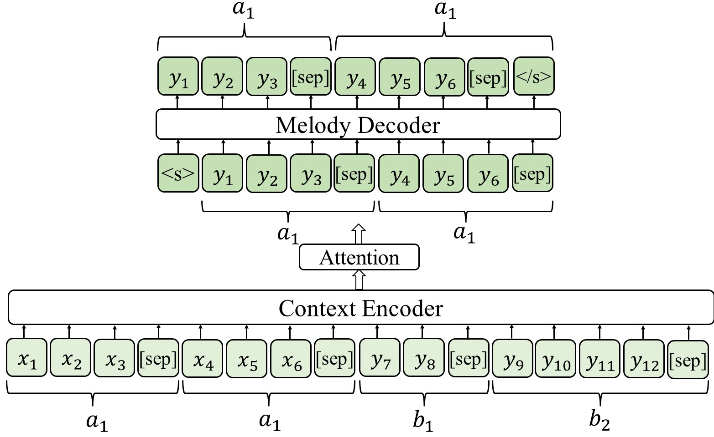

# MeloForm
MeloForm: Generating Melody with Musical Form based on Expert Systems and Neural Networks, by Peiling Lu, Xu Tan, Botao Yu, Tao Qin, Sheng Zhao, Tie-Yan Liu, ISMIR 2022, is a melody generation system that leverages expert system and neural networks to generate melodies with musical form.

<p align="center"><br/> The overall architecture of our MeloForm framework. </p>

<p align="center"><br/> The expert system of MeloForm. </p>

<p align="center"><br/> The neural network of MeloForm. </p>

## 1. Data 
We obtain LMD dataset from [here](https://colinraffel.com/projects/lmd/) and process them to be monophonic. We privode a [script](./process_lmd.py) to parse LMD data in our experiments. We give some raw data in melody tracks in [here](./data/train/raw) as examples to run scripts. 

```bash
python preprocess_lmd.py ./data/train/raw ./data/train/processed/para
```

Based on the above scripts, data samples will be generated under the `./data/train/processed/para` directory.

We have provide the [script](binarize.sh) to generate binarized data. The script to run is as:

```bash
data_dir=./data/train/processed/
user_dir=meloformt
bash binarize.sh $data_dir $user_dir
```

## 2. Training
We provide an example script for running.
```bash
data_dir=./data/train/processed/processed_para/ # The path of binarized data
user_dir=meloform

bash train.sh $data_dir $user_dir
```

## 3. Refinement
For refinement, we need to firstly process sythetic data from expert systems, then neural networks will refine it phrase by phrase iteratively. We provide several melodies from expert system to help test, more data will be released soon.

Firstly, run the following script to process sythetic data from expert systems:

```bash
data_dir=./data/refine/expert_system
song_id=0
out_dir=./data/refine/data_nn
python process_es.py $data_dir $song_id $out_dir
```

The processed results are under `./data/refine/data_nn/{song_id}`, in `./data/refine/data_nn/{song_id}/template`.

Finally, run

```bash
data_dir=./data/refine/data_nn
song_id=0
model_path=checkpoints/
res_dir=results/
bash meloform_refine_melody.sh $data_dir $song_id $model_path $res_dir
```

The final refined melody will be located in `{res_dir}/out_midi/{song_id}/b1/src_res.mid`