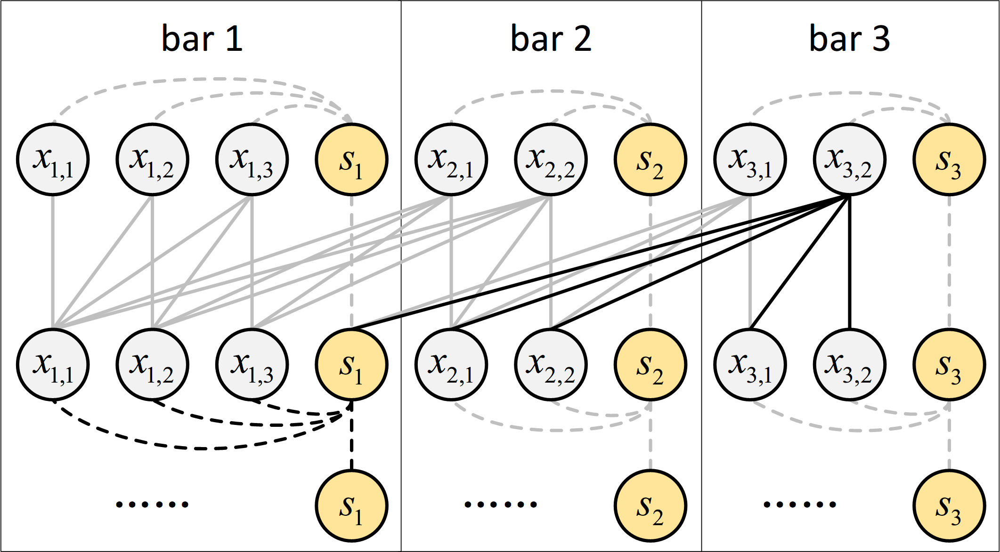

# Museformer

[Museformer: Transformer with Fine- and Coarse-Grained Attention for Music Generation](https://arxiv.org/abs/2210.10349), by Botao Yu, Peiling Lu, Rui Wang, Wei Hu, Xu Tan, Wei Ye, Shikun Zhang, Tao Qin, Tie-Yan Liu, NeurIPS 2022, is a Transformer with a novel fine- and coarse-grained attention (FC-Attention) for music generation. Specifically, with the fine-grained attention, a token of a specific bar directly attends to all the tokens of the bars that are most relevant to music structures (e.g., the previous 1st, 2nd, 4th and 8th bars, selected via similarity statistics); with the coarse-grained attention, a token only attends to the summarization of the other bars rather than each token of them so as to reduce the computational cost. The advantages are two-fold. First, it can capture both music structure-related correlations via the fine-grained attention, and other contextual information via the coarse-grained attention. Second, it is efficient and can model over 3X longer music sequences compared to its full-attention counterpart. Both objective and subjective experimental results demonstrate its ability to generate long music sequences with high quality and better structures.

demo: [link](https://ai-muzic.github.io/museformer)

<p align="center"><br/>Information flow of FC-Attention. </p>


The following content describes the steps to run Museformer. All the commands are run at the root directory of Museformer (named as `root_dir`) unless specified.

## 1. Dataset

We use [the Lakh MIDI dataset](https://colinraffel.com/projects/lmd/) (LMD-full). Specifically, we first preprocess it as described in the Appendix of our paper. The final dataset (see the file lists [here](data/meta)) contains 29,940 MIDI files. Their time signatures are all 4/4, and the instruments are normalized to 6 basic ones: square synthesizer (80), piano (0), guitar (25), string (48), bass (43), drum, where in the parentheses are MIDI program IDs if applicable. We put all the MIDI files in `data/midi`.

Install [MidiProcessor](https://github.com/btyu/MidiProcessor). Then, encode the MIDI files into tokens:

```bash
midi_dir=data/midi
token_dir=data/token
mp-batch-encoding $midi_dir $token_dir --encoding-method REMIGEN2 --normalize-pitch-value --remove-empty-bars --ignore-ts --sort-insts 6tracks_cst1
```

where the arguments are explained as follows:

- `encoding-method`: the representation method. We use the one called REMIGEN2, a REMI-like representation method that represents musical information in separate tokens.
- `normalize-pitch-value`: normalize pitches so as to make the song *C major* or *A minor*.
- `remove-empty-bars`: remove empty bars at the beginning or the end of a song.
- `ignore-ts`: do not add the tokens of time signature. Since the used data are all 4/4, we do not encode it.
- `sort-insts`: designate a method that sorts the instruments. `6tracks_cst1` sorts the instruments in order: square synthesizer, drum, bass, guitar, piano, string.

After encoding, you should see the token representation of each MIDI file in `output_dir`. 

Then, run the following command to gather the tokens for each split.

```bash
token_dir=data/token
split_dir=data/split
for split in train valid test : 
	do python tools/generate_token_data_by_file_list.py data/meta/${split}.txt $token_dir $split_dir ;
done
```

Next, use `fairseq-preprocess` to make binary data:

```bash
split_dir=data/split
data_bin_dir=data-bin/lmd6remi

mkdir -p data-bin

fairseq-preprocess \
  --only-source \
  --trainpref $split_dir/train.data \
  --validpref $split_dir/valid.data \
  --testpref $split_dir/test.data \
  --destdir $data_bin_dir \
  --srcdict data/meta/dict.txt
```

 Now, you should see the binary data in `data-bin/lmd6remi`.

##  2. Environment

The implementation of Museformer relies on specific hardware and software environment.

- Hardware environment: we recommend Nvidia V100 32GB. Other GPUs are not tested.

- Software environment: 

    please ensure these packages are installed:
    
    ```
    CUDA:          11.3.1
    Python:        3.8
    fairseq:       0.10.2
    tensorboardX:  2.2
    ```
    
    And install [triton](https://github.com/openai/triton) at an arbitrary directory except `root_dir`:
    
    ```bash
    cd /path/to/a/directory/for/triton
    git clone https://github.com/openai/triton.git
    cd triton/python
    pip install -e .
    ```

## 3. Train

Run the following command to train Museformer:

```bash
bash ttrain/mf-lmd6remi-1.sh
```

In our experiment, we run it on 4 GPUs, and the batch size is set to 1, so the real batch size is 4. Current implementation only supports batch size = 1. You may change `UPDATE_FREQ` to modify the real batch size.

By modifying `con2con` and `con2sum`, you can control the bars for the fine-grained attention and the coarse-grained attention, respectively.

In your first run, it may take some time to build up auxiliary information and compile CUDA kernels, so you may take a cup of coffee at this moment.

You can download a checkpoint [here](https://1drv.ms/u/s!Aq3YEPZCcV5ibz9ySjjNsEB74CQ), and put it in `checkpoints/mf-lmd6remi-1` for evaluation and inference.

## 4. Evaluation

You can obtain perplexity on the test set with the following command:

```bash
bash tval/val__mf-lmd6remi-x.sh 1 checkpoint_best.pt 10240
```

The number `10240` indicates the maximum sequence length for calculation.

## 5. Inference

Use the following command to generate 5 music pieces, with the random seed set to 1:

```bash
mkdir -p output_log
seed=1
printf '\n\n\n\n\n' | bash tgen/generation__mf-lmd6remi-x.sh 1 checkpoint_best.pt ${seed} | tee output_log/generation.log
```

The number of `\n` controls the number of generated music pieces. The generation would take a while. Once done, the generation log will be saved at `output_log/generation.log`.

Then, use the following command to extract the generated token sequences from the generation log:

```bash
python tools/batch_extract_log.py output_log/generation.log output/generation --start_idx 1
```

You should see token representation of each generated music piece in `output/generation`.

Finally, run the following command to convert the token sequences into MIDI files:

```bash
python tools/batch_generate_midis.py --encoding-method REMIGEN2 --input-dir output/generation --output-dir output/generation
```

You should see the MIDI files in `output/generation`.

