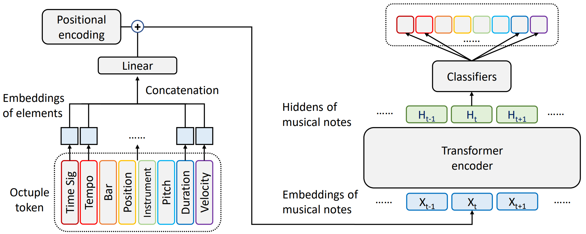
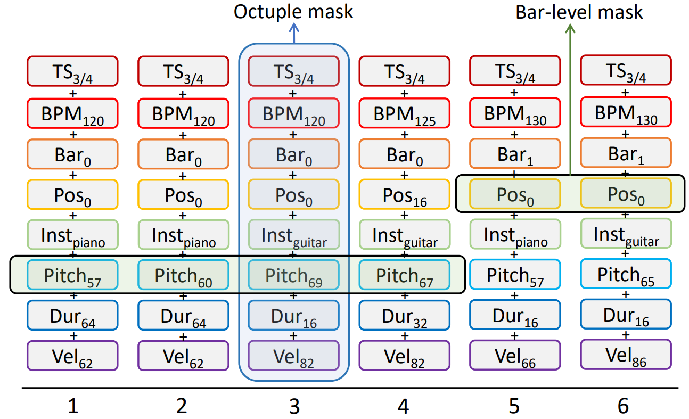

# MusicBERT
[MusicBERT: Symbolic Music Understanding with Large-Scale Pre-Training](https://arxiv.org/pdf/2106.05630.pdf), by Mingliang Zeng, Xu Tan, Rui Wang, Zeqian Ju, Tao Qin, Tie-Yan Liu, ACL 2021, is a large-scale pre-trained model for symbolic music understanding. It has several mechanisms including OctupleMIDI encoding and bar-level masking strategy that are specifically designed for symbolic music data, and achieves state-of-the-art accuracy on several music understanding tasks, including melody completion, accompaniment suggestion, genre classification, and style classification.

Projects using MusicBERT:

* [midiformers](https://github.com/tripathiarpan20/midiformers): a customized MIDI music remixing tool with easy interface for users. ([notebook](https://colab.research.google.com/drive/1C7jS-s1BCWLXiCQQyvIl6xmCMrqgc9fg?usp=sharing))

<!--   -->

<p align="center"><br/> Model structure of MusicBERT </p>
<p align="center"><br/> OctupleMIDI encoding </p>

## 1. Preparing datasets

### 1.1 Pre-training datasets

* Prepare [The Lakh MIDI Dataset](https://colinraffel.com/projects/lmd/) (**LMD-full**) in zip format for pre-training. (say `lmd_full.zip`)

  ```bash
  wget http://hog.ee.columbia.edu/craffel/lmd/lmd_full.tar.gz
  tar -xzvf lmd_full.tar.gz
  zip -r lmd_full.zip lmd_full
  ```

* Run the dataset processing script. (`preprocess.py`)

  ```bash
  python -u preprocess.py
  ```

* The script should prompt you to input the path of the midi zip and the path for OctupleMIDI output.

  ```
  Dataset zip path: /xxx/xxx/MusicBERT/lmd_full.zip
  OctupleMIDI output path: lmd_full_data_raw
  SUCCESS: lmd_full/a/0000.mid
  ......
  ```
  
* Binarize the raw text format dataset. (this script will read `lmd_full_data_raw` folder and output `lmd_full_data_bin`)

  ```bash
  bash binarize_pretrain.sh lmd_full
  ```

### 1.2 Melody completion and accompaniment suggestion datasets

* Follow "PiRhDy: Learning Pitch-, Rhythm-, and Dynamics-aware Embeddings for Symbolic Music" (https://github.com/mengshor/PiRhDy) to generate datasets for melody completion task and accompaniment suggestion task, or [download](https://1drv.ms/u/s!Av1IXjAYTqPstx6rhUOq8f5BhnTb?e=ZA2Bqz) generated datasets directly.

  ```
  PiRhDy/dataset/context_next/train
  PiRhDy/dataset/context_next/test
  PiRhDy/dataset/context_acc/train
  PiRhDy/dataset/context_acc/test
  ```

* Convert these two datasets to OctupleMIDI format with `gen_nsp.py`.

  ```bash
  python -u gen_nsp.py
  ```

* The script should prompt you to input which downstream task to process. (**next** for melody task and **acc** for accompaniment task)

  ```
  task = next
  ```

* Binarize the raw text format dataset. (this script will read `next_data_raw` folder and output `next_data_bin`)

  ```bash
  bash binarize_nsp.sh next
  ```

### 1.3 Genre and style classification datasets

* Prepare [The Lakh MIDI Dataset](https://colinraffel.com/projects/lmd/) (**LMD-full**) in zip format. (say `lmd_full.zip`,  ignore this step if you have `lmd_full.zip`)

  ```bash
  wget http://hog.ee.columbia.edu/craffel/lmd/lmd_full.tar.gz
  tar -xzvf lmd_full.tar.gz
  zip -r lmd_full.zip lmd_full
  ```

* Get TOPMAGD and MASD midi to genre mapping [midi_genre_map](https://github.com/andrebola/patterns-genres/blob/master/data/midi_genre_map.json) from "On large-scale genre classification in symbolically encoded music by automatic identification of repeating patterns".(DLfM 2018) (https://github.com/andrebola/patterns-genres)

  ```bash
  wget https://raw.githubusercontent.com/andrebola/patterns-genres/master/data/midi_genre_map.json
  ```

* Generate these two datasets in OctupleMIDI format using the midi to genre mapping file with `gen_genre.py`.

  ```bash
  python -u gen_genre.py
  ```

* The script should prompt you to input which downstream task to process. (**topmagd** for genre task and **masd** for style task)

  ```bash
  subset: topmagd
  LMD dataset zip path: lmd_full.zip
  sequence length: 1000
  ```

* Binarize the raw text format dataset. (this script will read `topmagd_data_raw` folder and output `topmagd_data_bin`)

  ```bash
  bash binarize_genre.sh topmagd
  ```

## 2. Training


### 2.1 Pre-training

```bash
bash train_mask.sh lmd_full small
```

* **Download our pre-trained checkpoints here: [small](https://msramllasc.blob.core.windows.net/modelrelease/checkpoint_last_musicbert_small.pt) and [base](https://msramllasc.blob.core.windows.net/modelrelease/checkpoint_last_musicbert_base.pt), and save in the ` checkpoints` folder. (a newer version of fairseq is needed for using provided checkpoints: see [issue-37](https://github.com/microsoft/muzic/issues/37) or [issue-45](https://github.com/microsoft/muzic/issues/45))**


### 2.2 Fine-tuning on melody completion task and accompaniment suggestion task

```bash
bash train_nsp.sh next checkpoints/checkpoint_last_musicbert_base.pt
```

```bash
bash train_nsp.sh acc checkpoints/checkpoint_last_musicbert_small.pt
```

### 2.3 Fine-tuning on genre and style classification task

```bash
bash train_genre.sh topmagd 13 0 checkpoints/checkpoint_last_musicbert_base.pt
```

```bash
bash train_genre.sh masd 25 4 checkpoints/checkpoint_last_musicbert_small.pt
```

## 3. Evaluation

### 3.1 Melody completion task and accompaniment suggestion task

```bash
python -u eval_nsp.py checkpoints/checkpoint_last_nsp_next_checkpoint_last_musicbert_base.pt next_data_bin
```

### 3.2 Genre and style classification task

```bash
python -u eval_genre.py checkpoints/checkpoint_last_genre_topmagd_x_checkpoint_last_musicbert_small.pt topmagd_data_bin/x
```

