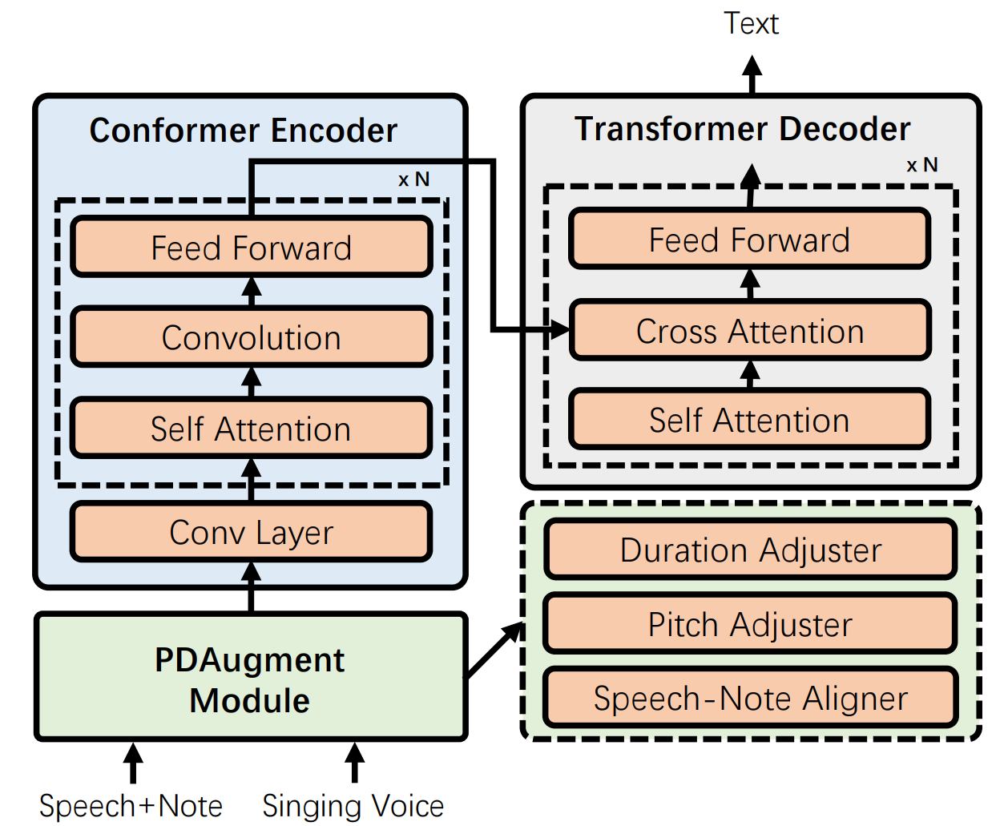
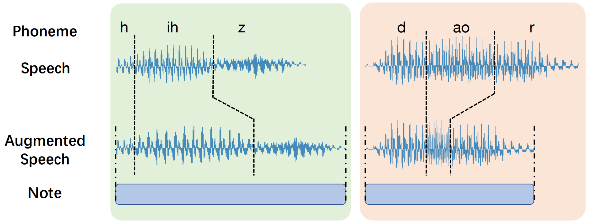

# PDAugment

[PDAugment: Data Augmentation by Pitch and Duration Adjustments for Automatic Lyrics Transcription](https://arxiv.org/pdf/2109.07940.pdf), by Chen Zhang, Jiaxing Yu, LuChin Chang, Xu Tan, Jiawei Chen, Tao Qin, Kejun Zhang, ISMIR 2022, is a data augmentation method that adjusts pitch and duration of speech to help the training of automatic lyrics transcription. It adjusts the pitch and duration of each syllable in natural speech to those of the corresponding note extracted from music scores, to narrow the gap between natural speech and singing voice. PDAugment outperforms previous state-of-the-art systems by 5.9% and 18.1% WERs on lyrics transription datasets DSing30 and Dali respectively. 


<p align="center"><br/> The pipeline of automatic lyrics transcription system equipped with PDAugment </p>

<br/>
<p align="center">  <br/> Pitch (left) and duration (right) adjustment </p>


## 1. Data Preparation

### 1.1 Speech (LibriSpeech)

#### **Download**

We use [LibriSpeech ASR corpus](https://www.openslr.org/12) as the speech corpus for augmentation.

Download and save the LibriSpeech ASR Corpus in `data/speech/raw`.

The default format of the downloaded audios is `flac`. We convert `flac` to `wav` by running:

```sh
sudo apt install ffmpeg  # Note that `ffmpeg` is needed
python flac2wav.py <flac_dir> <output_wav_dir>  # e.g., python flac2wav.py data/speech/raw/dev-clean data/speech/wav
```

`wav` file will be saved in `data/speech/wav`.

Take `data/speech/wav/dev-clean` for example, the directory of `dev-clean` is as follows:

```bash
├── dev-clean
│   └── 84
│        ├── 121123
│             ├── 84-121123-0000.wav
│             ├── 84-121123-0001.wav
│             ├── 84-121123-0002.wav
│             ├── ...
│             └── 84-121123.trans.txt
│        ├── ...
│   ├── ...
```

#### **Text to Phone**

PDAugment needs phoneme level text. So we should convert the text in `data/speech/wav` from word to phoneme by an open-source tool named [phonemizer](https://github.com/bootphon/phonemizer). Here we provide the python code (text2phone.py).

```sh
python text2phone.py <dataset_dir> <output_dir>              
# e.g, python text2phone.py data/speech/wav/dev-clean data/speech/phone
```

The output of the above code is an csv file containing metadata information about LibriSpeech ASR corpus and is saved in `data/speech/phone`.

```bash
|wav     |new_wav  |txt     |phone    |new_phone|
|--------|---------|--------|---------|---------|
```

#### **Phoneme Level Alignment**

After converting the text from word to phoneme, we obtain the phoneme level alignment of the speech audio by the [Montreal forced aligner (MFA)](https://github.com/MontrealCorpusTools/Montreal-Forced-Aligner) tool. Here we follow the [official example](https://montreal-forced-aligner.readthedocs.io/en/latest/example.html#example-1-aligning-librispeech-english). 

After MFA and data processing, we get the pickle file as follows:

(the list corresponding to an audio contains the split positions between each adjacent phoneme in this utterance)

```python
{
    "174-168635-0000.wav" : [0, 12, 18, 20...],
    "174-168635-0001.wav" : [0, 12, 27, 35...],
    "174-168635-0002.wav" : [0, 13, 26, 33...],
    ...
}
```

We can view the file as a dictionary and save the pickle file in `data/pickle`.

### 1.2 Music Scores (FreeMidi)

#### **Download**

In addition to the speech dataset, we also need a music dataset to provide guidance of melody. [FreeMidi Dataset](https://freemidi.org) is a good choice. We only use the [**pop songs**](https://freemidi.org/genre-pop) among them which contains about 4000 midi files.

Download and save the original pop songs midis in `data/midis/raw`

#### **Preprocessing**

In order to extract the note information of the melody, we need to clean the original multitrack data and recognize the lead track.

```shell
conda create -n midi python=3.6 -y
conda activate midi
pip install -r midi_preprocess/requirements.txt

PYTHONPATH=. python midi_preprocess/preprocess.py --config midi_preprocess/configs/default.yaml
```

Then the processed midi files can be found in `data/midis/processed/midi_6tracks`


## 2. PDAugment

After getting the phonemes, alignment and melody, we can now augment the dataset by PDAugment. 

Here we provide `pdaugment.py`.

### **Requirements**

We need to meet all the requirements of PDAugment.

```shell
conda create -n pdaugment python=3.6 -y
conda activate pdaugment
sudo apt-get install libsasl2-dev python-dev libldap2-dev libssl-dev -y
pip install -r requirements.txt
```

### **Augmentation**

We need following command line parameters.

```sh
pickle_path             # directory of pickle data, e.g., data/pickle/mel_splits.pickle
frequency_json_file     # mapping between semitone and frequency, e.g., utils/frequency.json
dataset_dir             # directory of dataset, e.g., data/speech/wav/dev-clean
midi_file_fir           # directory of midi file, e.g., data/midis/processed/midi_6tracks
metadata_dir            # metadata information of dataset, e.g., data/speech/phone/dev-clean_metadata.csv
output_duration_dir     # output directory of duration-augmented wav, e.g., data/duration
output_pitch_dir        # output directory of pitch-augmented wav, e.g., data/pitch
output_pdaugment_dir    # output directory of PDAugmented wav, e.g., data/pdaugment
selected_dir            # select directory for training, validating and testing, e.g., ${output_pdaugment_dir}
```

You can augment the speech dataset with multiple threads by setting:

```sh
number_of_threads       # number of threads to process, e.g., 16
```

Finally run the `pdaugment.py`.

```sh
python pdaugment.py <pickle_path> <frequency_json_file> <dataset_dir> <midi_file_fir> <metadata_dir> <output_duration_dir> <output_pitch_dir> <output_pdaugment_dir> <number_of_threads>
# e.g., python pdaugment.py data/pickle/mel_splits.pickle utils/frequency.json data/speech/wav/dev-clean data/midis/processed/midi_6tracks data/speech/phone/dev-clean_metadata.csv data/duration data/pitch data/pdaugment 16
```

The corresponding augmented audios will be generated and saved in certain directories.
