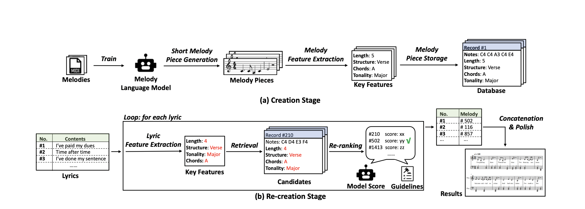

# Re-creation of Creations (ROC)

[Re-creation of Creations: A New Paradigm for Lyric-to-Melody Generation](https://arxiv.org/pdf/2208.05697.pdf), by Ang Lv, Xu Tan, Tao Qin, Tie-Yan Liu, Rui Yan, arXiv 2022, is a new paradigm for lyric-to-melody generation to address the following issues through a generation-retrieval pipeline: (1) lack of aligned lyric-melody training data to sufficiently learn lyric-melody feature alignment; (2) lack of controllability in generation to explicitly guarantee the lyric-melody feature alignment. ROC has no requirement on paired lyric-melody data, and considers music theories and composition guidelines explicitly, which provides great controllability.


<p align="center"><br/> Pipeline of ROC </p>

## 1. Inference

(1) Put melody language model and the database into the folder 'music-ckps' and 'database', respectively. The model and the database can be downloaded [here](https://drive.google.com/drive/folders/1TpWOMlRAaUL-R6CRLWfZK1ZeE1VCaubp?usp=sharing)

(2) Prepare lyrics data. Please write your lyrics in 'lyrics.txt', , one line for each song. Please set the lyrics language and a chord progression for each song in 'chord.txt'. Do not leave a space in the end of lines. We have provided bilingual examples in the two files.

(3) Run the ROC:
  ```shell
   python lyrics_to_melody.py
   ```
For each line in 'lyrics.txt', ROC generates a midi file named as the first sentence in lyrics.

(4) Here are the arguments of the script:

|Argument|Default value|Help|
|----|----|----|
|--lyrics_path|default='lyrics.txt'|Lyrics file path|
|--chord_path|default='chord.txt'|Chord prgressions file path|
|--db_path|default='database/ROC.db'|Database path|
|--debug|action='store_true'| If true, output composition details|
|--sentiment|action='store_true'| If true, automatically set tonality by analyzing sentiment.|

Beyond given arguments, there are some functions can be extended, e.g., because ROC is language-insensitive, you can modify a few lines to support other languages. Such extensions are pointed out in comments of the code.


## 2. Train the melody language model

(1) Prepare MIDI files. We use [lmd-matched](https://colinraffel.com/projects/lmd/) MIDI dataset in ROC.

```shell
wget http://hog.ee.columbia.edu/craffel/lmd/lmd_matched.tar.gz
tar -xzvf lmd_matched.tar.gz
```

(2) Turn melodies into strings.
```shell
python gen.py lmd_matched lmd_matched
```

(3) Train the melody language model.

```shell
bash melody_lm.sh
```

## 3. Construct the database

(1) Prepare pitch embeddings which is used to recognize melody structure. We have provided a embedding file 'utils/embedding.txt', but you can obtain your own version by many ways, such as saving the melody language model's embedding weights or using fasttext to process the training data of the model.

(2) Correct the format. The training data generate by 'gen.py' sometimes violates format standards in ROC's setting, which we have to correct:
```shell
cd utils
python format_correct.py 
```
This command will generates two files 'maj.notes' and 'min.notes' in the current folder.

(3) Use the language model to generate short pieces.
```shell
python lm_generate_piece.py maj.notes
python lm_generate_piece.py min.notes
```
Generated short pieces are deduplicated and structure (chorus or verse) anotated. Note that this procedure is very time-consuming, and we recommend that you can split the 'maj.notes' and 'min.notes', and process them in parallel then concatenate. After this step, you can get four files: 'maj_chorus.notes', 'maj_verse.notes', 'min_chorus.notes', 'min_verse.notes'.

(4) Store pieces in the database.
```shell
python piece_to_database maj_chorus.notes
python piece_to_database maj_verse.notes
python piece_to_database min_chorus.notes
python piece_to_database min_verse.notes
```
After this step, a database named 'ROC.db' will be constructed in '../database' folder.

## 4. Evaluation

To evaluate DIST and ENT, we use the script from this repo: https://github.com/lemon234071/AdaLabel/blob/master/scripts/eval.py


You can find demo samples by ROC from [https://ai-muzic.github.io/roc/](https://ai-muzic.github.io/roc/).
