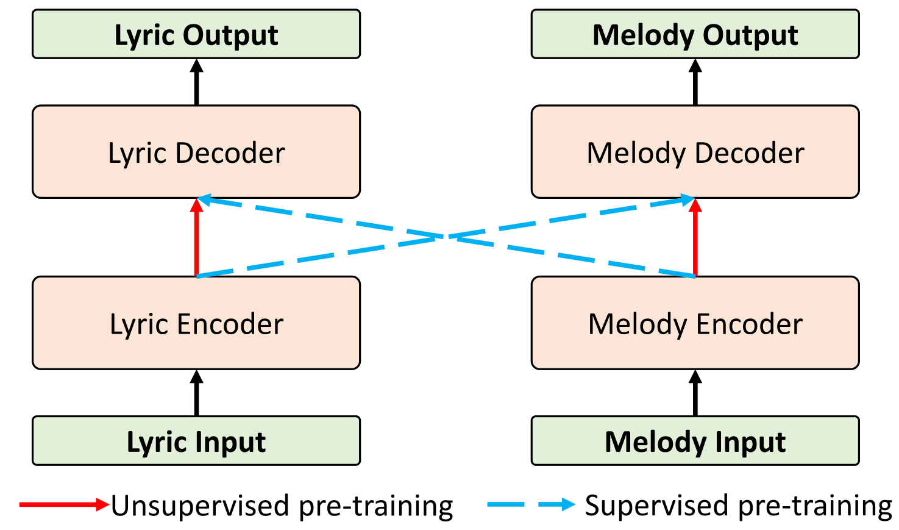
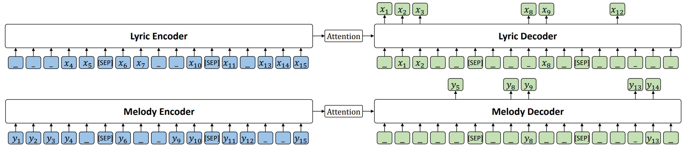

# SongMASS

[SongMASS: Automatic Song Writing with Pre-training and Alignment Constraint](https://arxiv.org/pdf/2012.05168.pdf), by Zhonghao Sheng, Kaitao Song, Xu Tan, Yi Ren, Wei Ye, Shikun Zhang, Tao Qin, AAAI 2021, is a song writing system that leverages masked sequence to sequence ([MASS](https://github.com/microsoft/MASS)) pre-training and attention-based alignment modeling for lyric-to-melody and melody-to-lyric generation. 

<p align="center"><br/> The overall architecture of our SongMASS framework </p>

<p align="center"><br/> The song-level MASS pre-training </p>

## 1. Data 
We obtain LMD dataset from [here](https://github.com/yy1lab/Lyrics-Conditioned-Neural-Melody-Generation). We privode a [script](data/generate_lmd_dataset.py) to parse LMD data in our experiments. We provide a example to instruct how to parse LMD data in our paper.

```bash
git clone https://github.com/yy1lab/Lyrics-Conditioned-Neural-Melody-Generation
DATADIR=Lyrics-Conditioned-Neural-Melody-Generation/lmd-full_MIDI_dataset/Sentence_and_Word_Parsing
OUTPUTDIR=data_org

python data/generate_lmd_dataset.py --lmd-data-dir $DATADIR --output-dir $OUTPUTDIR
bash generate_data.sh $OUTPUTDIR
```
Based on the above scripts, data samples will be generated under the `data_org` directory. We consider para data as mono data and convert lyric file into bpecode to handle dictionary. The processed bpecode and dictionaries have been uploaded under [data](data/). We move dictionary files to `mono` and `para` directory. The format is as:
```bash
├── data_org
│   └── mono
│        ├── train.melody
│        ├── train.lyric
│        ├── valid.melody
│        ├── valid.lyric
│        ├── dict.lyric.txt
│        └── dict.melody.txt
│   └── para
│        ├── train.melody
│        ├── train.lyric
│        ├── valid.melody
│        ├── valid.lyric
│        ├── test.melody
│        ├── test.lyric
│        ├── dict.lyric.txt
│        ├── dict.melody.txt
│        ├── song_id_valid.txt
│        └── song_id_test.txt
```
We have provide the [script](preprocess.sh) to generate binarized data. The format is as:
```bash
# Ensure the output directory exists
data_dir=data_org/

# set this relative path of MASS in your server
user_dir=mass

bash preprocess.sh $data_dir $user_dir
```

## 2. Training
We provide an example script for running.
```bash
data_dir=data_org/processed # The path of binarized data
user_dir=mass

bash train.sh $data_dir $user_dir
```

## 3. Inference
For lyric inference, the running script is as below:
```bash
data_dir=data_org/processed
user_dir=mass
model=checkpoint_best.pt # your model path

bash infer_lyric.sh  $data_dir $user_dir $model
```

For melody generation, the running script is as below:
```bash
data_dir=data_org/processed
user_dir=mass
model=checkpoint_best.pt # your model path

bash infer_melody.sh  $data_dir $user_dir $model
```
A pre-trained model can be downloaded from [here](https://huggingface.co/msramuzic/songmass/resolve/main/songmass.pth)

## 4. Evaluation
We provide scripts under the [evaluation](evaluate/) folder to test the pitch/duration similarity and melody distance. The examples are as:
```bash
LYRIC=lyric.gt # The lyric file of ground truth
MELODY=melody.gt # The melody file of ground truth
HYPOS=hypo.txt # The generated result in fairseq format
SONG_ID=song_id_test.txt # The song id file

cd evaluate/

# pitch distribution similarity 
python evaluate_histo.py \
  --lyric-file $LYRIC \
  --melody-file $MELODY \
  --song-id-file $SONG_ID \
  --generated-melody-file $HYPOS \
  --metric pitch 

# duration distribution similarity
python evaluate_histo.py \
  --lyric-file $LYRIC \
  --melody-file $MELODY \
  --song-id-file $SONG_ID \
  --generated-melody-file $HYPOS \
  --metric duration  
  
# melody distance
python evaluate_timeseries.py \
  --lyric-file $LYRIC \
  --melody-file $MELODY \
  --song-id-file $SONG_ID \
  --generated-melody-file $HYPOS
```

For more generated samples, please visit [https://ai-muzic.github.io/songmass/](https://ai-muzic.github.io/songmass/).
