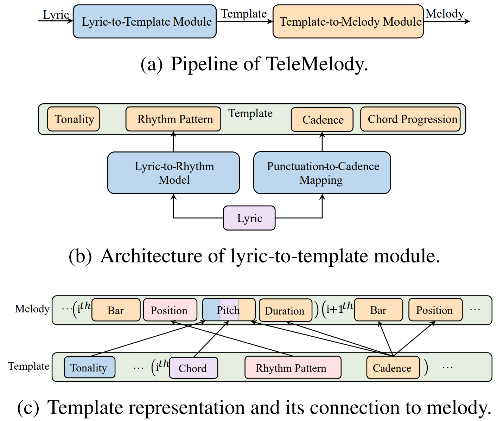

# TeleMelody

[TeleMelody: Lyric-to-Melody Generation with a Template-Based Two-Stage Method](https://arxiv.org/pdf/2109.09617.pdf), by Zeqian Ju, Peiling Lu, Xu Tan, Rui Wang, Chen Zhang, Songruoyao Wu, Kejun Zhang, Xiangyang Li, Tao Qin, Tie-Yan Liu, arXiv 2021, is a two-stage lyric-to-melody generation system with music template (e.g., tonality, chord progression, rhythm pattern, and cadence) to bridge the gap between lyrics and melodies. TeleMelody consists of a lyric-to-template module and a template-to-melody module, and generates melodies with higher quality, better controllability, and less requirement on paired lyric-melody data than previous generation systems.


<p align="center"><br/> Architecture of TeleMelody </p>

## 1. Training

### 1.1 Lyric-to-Rhythm

(1) Prepare lyric-to-rhythm dataset. We provide several examples in directory `data/en_example` and `data/zh_example`. Due to potential copyright issues, we cannot share the training data, but you can follow the pipeline mentioned in our [paper](https://arxiv.org/pdf/2109.09617.pdf) to get the training data.  

(2) Train lyric-to-rhythm model.

   ```shell
   cd training/lyric2rhythm/
   bash train.sh data/example example 8192
   ```

### 1.2 Template-to-Melody

(1) Prepare [lmd-matched](https://colinraffel.com/projects/lmd/) MIDI dataset.

   ```shell
   cd training/template2melody/
   wget http://hog.ee.columbia.edu/craffel/lmd/lmd_matched.tar.gz
   tar -xzvf lmd_matched.tar.gz
   ```

(2) Generate training data and alignments.

   ```shell
   python gen.py lmd_matched lmd_matched
   python gen_align.py lmd_matched
   ```

(3) Train template-to-melody model.

   ```shell
   bash preprocess.sh lmd_matched lmd_matched
   bash train.sh lmd_matched
   ```

## 2. Inference

2.1 Modify `miditoolkit` to support Chinese lyrics.

   (1) 
   ```shell
   git clone https://github.com/YatingMusic/miditoolkit.git
   cd miditoolkit
   ```

   (2) Modify `miditoolkit/midi/parser.py`.

      raw:

   ```python
      318    def dump(self,
      319              filename=None,
      320              file=None,
      321              segment=None,
      322              shift=True,
      323              instrument_idx=None):
      ...
      371 midi_parsed=mido.MidiFile(ticks_per_beat=self.ticks_per_beat)
   ```

      Modified:

   ```python
      318    def dump(self,
      319              filename=None,
      320              file=None,
      321              segment=None,
      322              shift=True,
      323              instrument_idx=None,
      324              charset ='latin1'):
      ...
      372 midi_parsed=mido.MidiFile(ticks_per_beat=self.ticks_per_beat, charset=charset)
   ```

   (3) Install `miditoolkit`.

   ```shell
   pip uninstall miditoolkit
   python setup.py install
   ```

2.2 Save checkpoints in `checkpoints/{model_prefix}` and dictionary in `data-bin/{model_prefix}`.

2.3 Prepare word-level (EN) or character-level (ZH) lyrics in `data/{lang}/{data_prefix}/lyric.txt` and chord progression in `data/{lang}/{data_prefix}/chord.txt`. For English lyrics, additionally prepare syllable-level lyrics in `data/en/{data_prefix}/syllable.txt` as the input of lyric-to-rhythm model. We provide examples in `data/en/test/` and `data/zh/test/`.

2.4 Infer. Results are saved in directory `results/{save_prefix}/midi/`.

   ```shell
   
   cd inference/
   (EN):
   python infer_en.py {en_lyric2rhythm_prefix} {template2melody_prefix} {en_data_prefix} {en_save_prefix}

   (ZH):
   python infer_zh.py {zh_lyric2rhythm_prefix} {template2melody_prefix} {zh_data_prefix} {zh_save_prefix}
   ```

## 3. Evaluation

3.1 PD & DD 

  Prepare generated melodies in ``{hyp_prefix}/{song_id}.mid`` and ground-truth melodies in ``{gt_prefix}/{song_id}.mid``.

  ```shell
  cd evaluation
  python cal_similarity.py {gt_prefix} {hyp_prefix}
  ```

3.2 MD:

  Prepare generated melodies in ``{hyp_prefix}/{song_id}.mid`` and ground-truth melodies in ``{gt_prefix}/{song_id}.mid``.

  ```shell
  python cal_dtw.py {gt_prefix} {hyp_prefix}
  ```

3.3 TA, CA, RA, AA

  Prepare melody in `{prefix}/test.hyp.txt` and template in `{prefix}/test.src.txt`.

  ```shell
  python cal_acc.py {prefix}
  ```


You can find demo samples by TeleMelody from [https://ai-muzic.github.io/telemelody/](https://ai-muzic.github.io/telemelody/).
